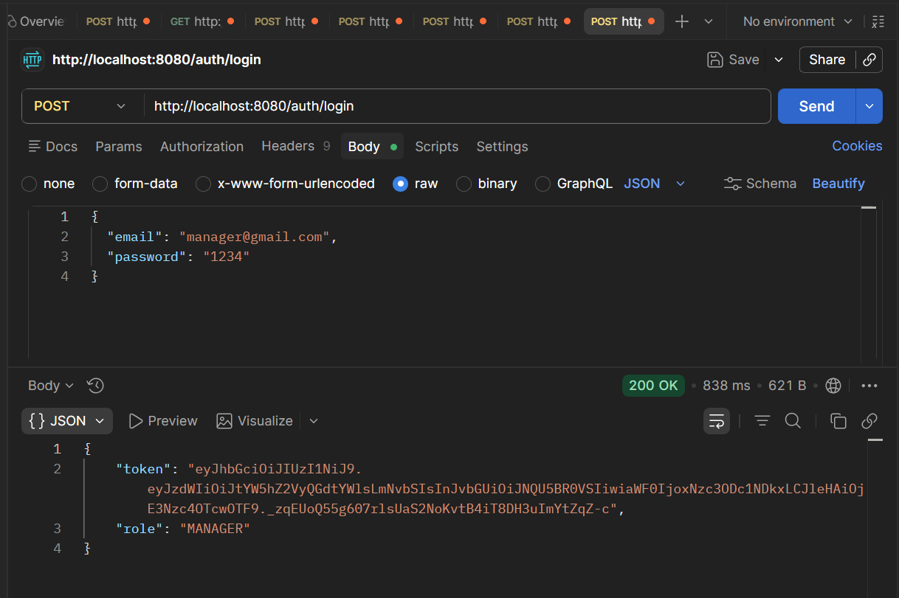
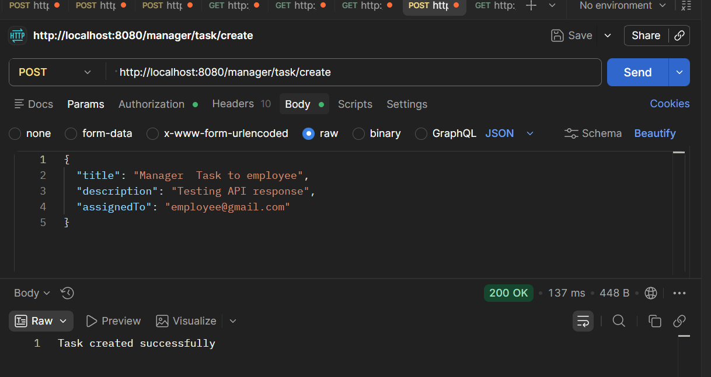
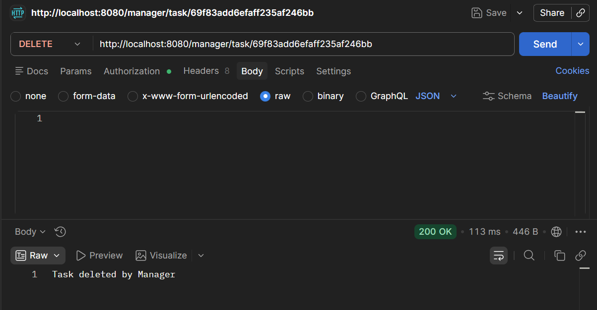
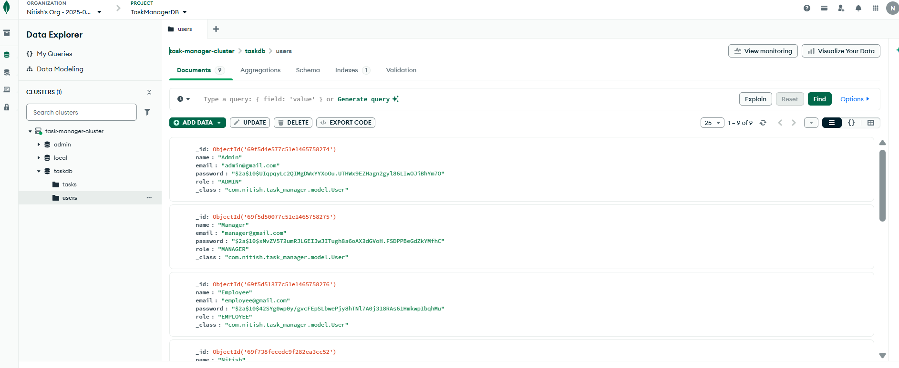
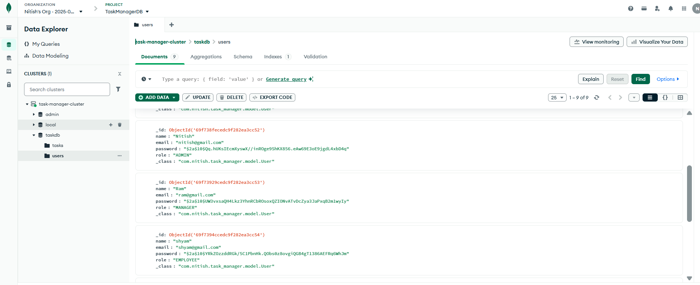
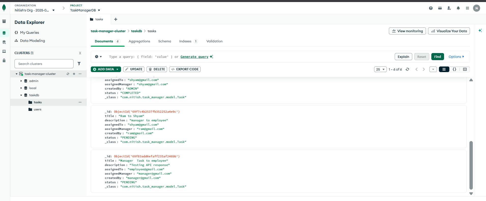
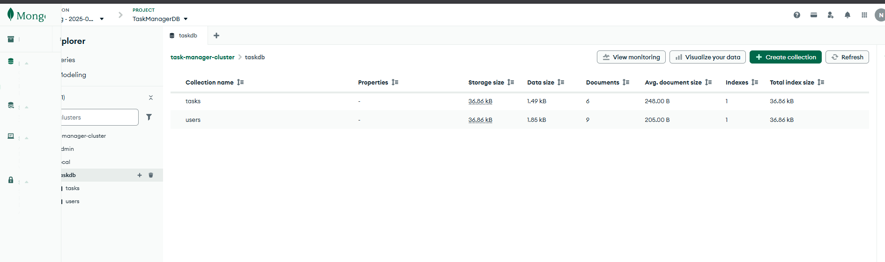

# 🚀 Task Manager Backend

A secure and scalable **Spring Boot backend** for a role-based task management system with JWT authentication and MongoDB.

---

## 🔐 Features

* JWT-based Authentication & Authorization
* Role-based access control (**Admin, Manager, Employee**)
* Task creation, assignment, update, and deletion
* Secure REST APIs
* MongoDB integration
* Clean layered architecture (Controller → Service → Repository)

---

## 🔄 Role-Based Workflow

### 👑 Admin

* Create tasks
* Delete **any task**
* Update task status
* Full system control

### 🧑‍💼 Manager

* Assign tasks to employees
* Create tasks
* Update task status
* Delete tasks **within their group only**
* ❗ Cannot delete tasks created/assigned by Admin

### 👨‍💻 Employee

* View assigned tasks
* Update task status
* ❌ Cannot create or delete tasks

---

## 🧪 API Testing (Postman)

### 🔐 Token Generation (Login API)



### ✅ Create Task API



### ❌ Delete Task API



---

## 🗄️ Database (MongoDB)

### 👤 Users Collection

Stores user details including roles (Admin, Manager, Employee) and authentication data.



---

### 👥 Additional Users Data

Represents extended user data and role relationships.



---

### 📋 Tasks Collection

Stores all tasks with fields like title, description, assigned user, manager, and status.



---

### 📊 Dashboard View

Provides an overview of task distribution and user activity.



---

## 🛠️ Tech Stack

* Java
* Spring Boot
* Spring Security
* JWT
* MongoDB
* Maven

---

## 📁 Project Structure

```
src/
├── controller/
├── service/
├── repository/
├── model/
├── dto/
├── config/
└── security/
```

---

## ⚙️ Setup Instructions

### 1. Clone the repository

```bash
git clone https://github.com/your-username/task-manager-backend.git
cd task-manager-backend
```

### 2. Configure environment

Update `application.properties`:

```
spring.data.mongodb.uri=your_mongodb_connection
jwt.secret=your_secret_key
```

### 3. Run the application

```bash
mvn spring-boot:run
```

---

## 📌 Highlights

* Secure role-based authorization implemented
* Proper separation of concerns (DTO, Service layer)
* Real-world backend architecture
* Tested APIs with Postman

---

## 👨‍💻 Author

Nitish Kamati
